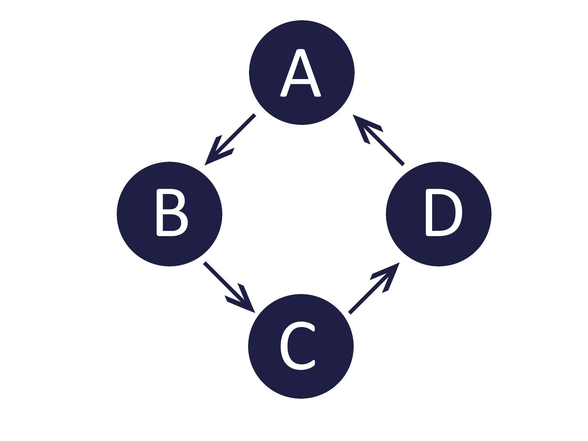
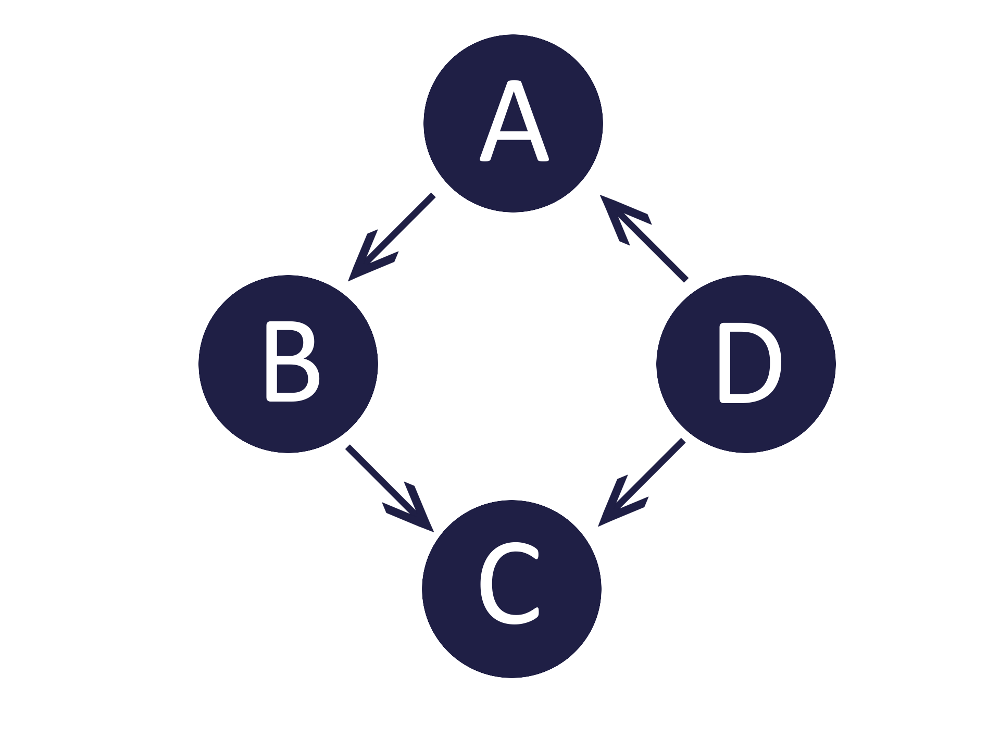
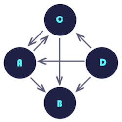
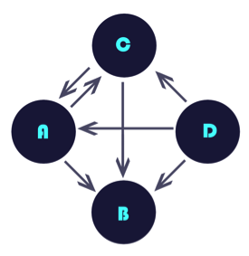
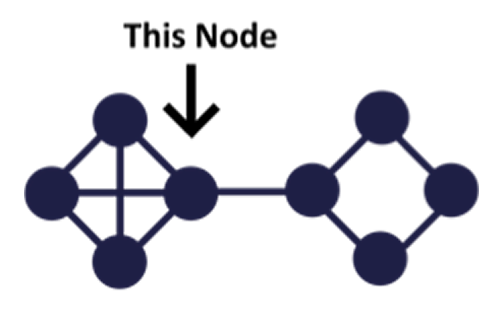
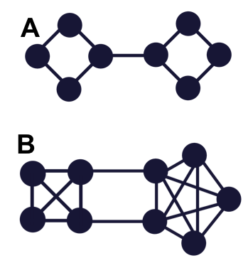

# Quiz 3 - Connectivity, Community, and Centrality Analytics

### 1. The example given in the lectures of when a power network loses power in large portions of its service area was an example of what?

- a problem that can occur when centrality is too high
- **an attack which causes disconnection of the graph**
- high levels of connectivity which make it easy to bring a network down

### 2. Is the following graph strongly connected, weakly connected or neither?

- neither
- **strongly connected**
- weakly connected

### 3. Is the following graph strongly connected, weakly connected or neither?

- neither
- strongly connected
- **weakly connected**

### 4. If you were going to look for a node which would be most likely to be the target of an attack to disconnect a network, what would be the best characteristic to look for?

- **high degree nodes**
- low degree nodes
- nodes that, if they were removed, would cause the graph to go from strongly connected to weakly connected

### 5. What is the out-degree of node B?

- **0**
- 1
- 2
- 3

### 6. In the graph below, which node is the greatest listener?

- A
- **B**
- C
- D

### 7. In the graph below, which nodes are the greatest communicators? (Hint: there's a tie)

 
- **A**
- B
- **C**
- D

### 8. What would we be looking for if we followed the steps below? Note: we have 2 graphs.

Create a table for each graph where, for each node, you list the degree of the node.
For each graph, create a histogram indicating how many nodes in that graph have a specific degree (e.g., how many nodes have degree 1? 2? etc.).
Use advanced approaches (e.g. Euclidean distances) to compare these two histograms.

- Connectivity
- Centrality
- **Similarity**
- Community

### 9. Which of the following are the three type of analytics questions asked about communities?

- **Static**
- **Evolution**
- **Prediction**
- Connection

### 10. What type of community analytics question is the following?

Did a community form on twitter around the 2014 World Cup in Brazil?

- Static
- Prediction
- Connection
- **Evolution**

### 11. Which type of community analytics question is the following?

How tightly knit was the 2014 World Cup twitter community on July 13, 2014 (the day of the finals)?

- **Static**
- Evolution
- Prediction
- Connection

### 12. What is the external degree of the node indicated in the graph below?

- 1
- 2
- 3
- 4

### 13. Which of the two graphs below is more modular?

- A
- **B**

### 14. Which of the following community tracking phases usually occurs when a company spins off a start-up?

- Split
- Birth
- Death
- Grow
- Merge
- Contract

### 15. An influencer in a network is defined as:

- **a node which can reach all other nodes quickly**
- the biggest gossip in the network
- a node which has heavy weight edges to at least 1/2 of the nodes in the network

### 16. Which of the following are the 2 core “key player” problems that centrality analytics can address?

- **A set of nodes which can reach (almost) all other nodes**
- What is the shortest path through a network
- **Which nodes' removal will maximally disrupt the network**
- Which nodes have the highest ratio of out-degree nodes to in-degree nodes

### 17. What kind of centrality would you want to analyze in a graph if you wanted to inject information that flows through the shortest path in a network and have it spread quickly?

- Degree
- Group
- **Closeness**
- Between-ness

### 18. What kind of centrality would you want to analyze in a graph if you wanted maximize commodity flow in a network?

- Group
- Degree
- Closeness
- **Between-ness**

### 19. What kind of centrality identifies "hubness"?

- Between-ness
- Closeness
- **Degree**
- Group